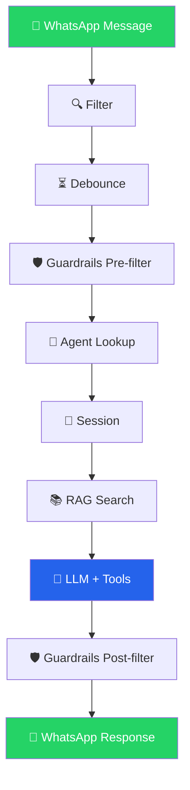

<div align="center">

<pre>
 ███╗   ██╗███████╗██╗  ██╗████████╗
 ████╗  ██║██╔════╝╚██╗██╔╝╚══██╔══╝
 ██╔██╗ ██║█████╗   ╚███╔╝    ██║
 ██║╚██╗██║██╔══╝   ██╔██╗    ██║
 ██║ ╚████║███████╗██╔╝ ██╗   ██║
 ╚═╝  ╚═══╝╚══════╝╚═╝  ╚═╝   ╚═╝
</pre>

<p><strong>IA que atende por você</strong></p>

<p>Intelligent WhatsApp secretary — an AI agent on your personal number,<br>
powered by any OpenAI-compatible LLM, with a full web UI for management.</p>

<sub>Self-hosted · No Business API · Any LLM · Zero build step</sub>

<br><br>

[](https://go.dev)
[](Dockerfile)
[](/)
[](LICENSE)

</div>

<br>

<p align="center">
<a href="#-features">Features</a> ·
<a href="#-quick-start">Quick Start</a> ·
<a href="#-built-in-tools">Built-in Tools</a> ·
<a href="#-architecture">Architecture</a> ·
<a href="#-development">Development</a> ·
<a href="#-tech-stack">Tech Stack</a> ·
<a href="#-license">License</a>
</p>

---

## ✨ Features

<table>
<tr>
<td>📱 <strong>WhatsApp via QR code</strong><br>Uses your personal number, no Business API</td>
<td>🤖 <strong>Any OpenAI-compatible LLM</strong><br>OpenAI, Groq, Ollama, Together, LM Studio…</td>
</tr>
<tr>
<td>🔧 <strong>16 built-in tools</strong><br>Plus custom API tools and MCP protocol</td>
<td>📚 <strong>Knowledge base (RAG)</strong><br>FTS5 full-text search + embedding similarity</td>
</tr>
<tr>
<td>👥 <strong>Up to 10 agents</strong><br>Independent personality, model, provider + chaining</td>
<td>🛡️ <strong>Guardrails</strong><br>Whitelist/blacklist, anti-injection, PII filtering</td>
</tr>
<tr>
<td>⏳ <strong>Message debounce</strong><br>Groups rapid messages before sending to AI</td>
<td>🧠 <strong>Session management</strong><br>Auto-summaries prevent hallucination</td>
</tr>
<tr>
<td>🖥️ <strong>Full web UI</strong><br>Config, conversations, logs, knowledge, reports, chat</td>
<td>🔐 <strong>Multi-user auth</strong><br>Admin/user roles, bcrypt, persistent sessions</td>
</tr>
<tr>
<td>⏰ <strong>Scheduled messages</strong><br>Hourly, daily, weekly, monthly, cron expressions</td>
<td>🔌 <strong>MCP server</strong><br>Exposes all tools via SSE protocol</td>
</tr>
<tr>
<td>💬 <strong>WhatsApp groups</strong><br>Optional, configurable per group</td>
<td>🗄️ <strong>External databases</strong><br>Query MySQL and PostgreSQL from the AI</td>
</tr>
</table>

---

## 🚀 Quick Start

```bash
git clone https://github.com/renesul/Next.git
cd Next
make run
```

1. Open **http://localhost:8080**
2. Login with `admin` / `admin123`
3. Set your AI provider API key and base URL
4. Scan the WhatsApp QR code
5. Done — start chatting

<details>
<summary><strong>🐳 Docker</strong></summary>

```bash
docker compose up -d
```

Or build manually:

```bash
docker build -t next .
docker run -d -p 8080:8080 -v next-data:/data next
```

</details>

<details>
<summary><strong>📋 Requirements</strong></summary>

| Requirement | Details |
|---|---|
| **Go** | 1.25+ |
| **CGO** | Enabled (`gcc` / `build-essential` must be installed) |
| **OS** | Linux, macOS (Windows via WSL) |

</details>

<details>
<summary><strong>⚙️ Configuration</strong></summary>

| Variable | Default | Description |
|---|---|---|
| `PORT` | `8080` | HTTP server port |
| `DB_PATH` | `~/.next/` | Data directory (databases, logs) |

Both are optional. Set them in `.env` or as environment variables.

> **Everything else** (AI provider, system prompt, tools, guardrails, agents, etc.) is configured through the web UI and stored in SQLite.

</details>

---

## 🛠️ Built-in Tools

| Category | Tool | Description |
|---|---|---|
| **Time** | `get_datetime` | Current date, time, and day of week |
| **Tasks** | `create_task` | Create a task/reminder for the contact |
| | `list_tasks` | List tasks, optionally filtered by status |
| | `complete_task` | Mark a task as completed |
| **Knowledge** | `search_knowledge` | Search the knowledge base (RAG) |
| | `save_note` | Save persistent notes about a contact |
| | `get_notes` | Retrieve saved notes |
| **Web** | `search_web` | Web search via DuckDuckGo |
| | `fetch_url` | Fetch and extract text from a URL |
| | `weather` | Current weather for any location |
| | `currency` | Currency conversion with live rates |
| **Scheduling** | `schedule_message` | Schedule a message with optional recurrence |
| | `list_scheduled` | List pending scheduled messages |
| | `cancel_scheduled` | Cancel scheduled messages |
| **Data** | `calculate` | Evaluate math expressions |
| | `query_database` | Read-only SQL queries (local + external DBs) |

You can also add **custom API tools** (any REST endpoint) and **MCP tools** (via SSE transport) through the web UI.

---

## 🏗️ Architecture

### Message Flow



### Project Structure

```
main.go                       Entry point, wiring, signal handling, migrations

app/                          Business logic
  types/types.go              Shared types (Message, Agent, Contact, etc.)
  ai/ai.go                   OpenAI-compatible client (reply, summarize, embed)
  memory/memory.go            Sessions, history, summaries, token budget
  rag/rag.go                  Knowledge base with FTS5 + embeddings
  guardrails/guardrails.go    Pre/post-AI message filtering
  tools/tools.go              Function calling registry, built-in + custom tools
  tools/mcp.go                MCP client + MCP server
  pipeline/pipeline.go        Message processing pipeline

internal/                     Infrastructure
  config/config.go            Config struct + SQLite key-value store
  logger/logger.go            JSON file (always) + SQLite (debug mode)
  auth/auth.go                Multi-user auth (bcrypt, sessions, middleware)
  whatsapp/whatsapp.go        WhatsApp connection (QR, send, receive)
  debounce/debounce.go        Message grouping per contact
  web/web.go                  HTTP routes and API handlers

templates/                    HTML pages (inline CSS/JS, no build step)
```

---

## 🧑‍💻 Development

```bash
make build               # Build binary (output: next)
make test                # Run all tests
make lint                # Run golangci-lint
make fmt                 # Format code
make check               # deps + fmt + vet + test (full CI check)
make install             # Build and install to ~/.next
make generate            # Run go generate
make run                 # Build and run
make clean               # Remove binary
```

### Databases

Stored in `~/.next/` (or `DB_PATH`):

| File | Purpose |
|---|---|
| `next.db` | App data (config, messages, summaries, knowledge, tasks, tools, agents, users, sessions, logs) |
| `whatsapp.db` | WhatsApp session store (managed by whatsmeow) |

---

## 📦 Tech Stack

| Component | Technology |
|---|---|
| **Language** | Go |
| **Database** | SQLite with FTS5 |
| **WhatsApp** | whatsmeow (Web multidevice protocol) |
| **AI Client** | go-openai (any OpenAI-compatible API) |
| **MCP** | mcp-go (SSE transport) |
| **Auth** | bcrypt (golang.org/x/crypto) |
| **External DBs** | MySQL (go-sql-driver), PostgreSQL (lib/pq) |

---

## 📄 License

This project is licensed under the [MIT License](LICENSE).

---

<div align="center">

<sub>No frameworks, no build steps, no nonsense.</sub>

<br>

<sub><a href="https://github.com/renesul/Next">GitHub</a> · <a href="LICENSE">MIT License</a></sub>

</div>
